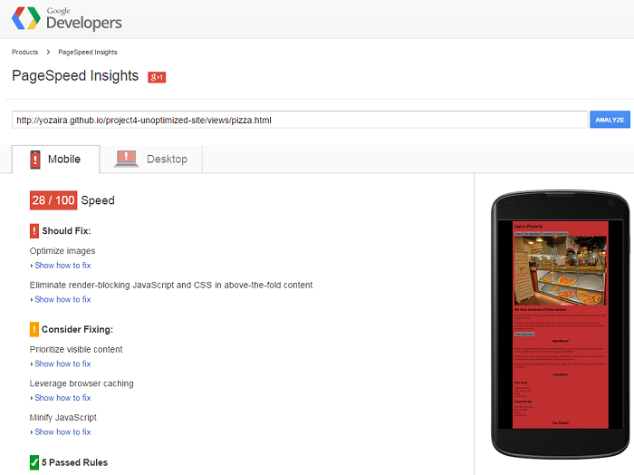
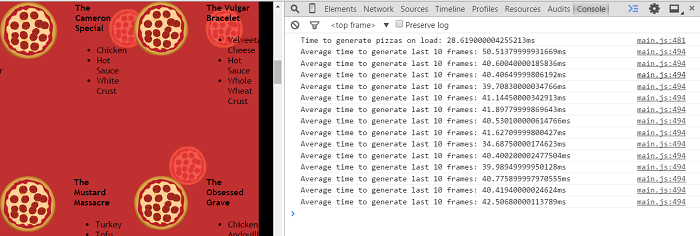
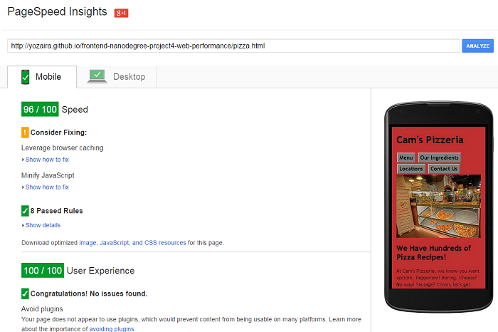
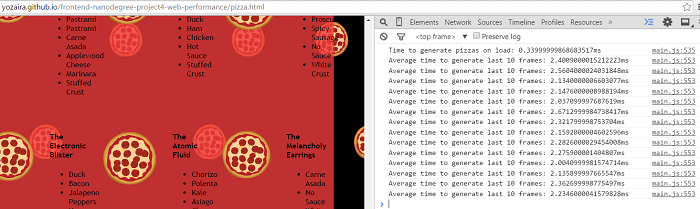

## Website Performance Optimization Project

### Summary

The main goal for this project is to fix performance-related issues of the provided sample
portfolio, and optimize it so that it achieves a PageSpeed score of 90 and runs at 60 frames
per second on both mobile and desktop environments.

<h3>Web Performance Optimization techniques used for this project:</h3>
-----------------------------------------------------------------------

#### 1- JavaScript Code Optimization:

* Identified inefficient code areas and improved them by applying the following best practices:

  - Eliminated, when possible, repeated DOM changes - like updating elements’ styles many times -
  to minimized unnecessary reflow (Browser re-calculation of document elements' position).

  - Moved some variables that were in the global scope to a local scope - in the function they were used.
  Variables in the global scope persist though the life time of the script, whereas in local scope they are destroyed when the local scope is lost. Also, local variables will considerably speed up performance as the local variable is stored in the most accessible part of the stack.

  - Moved some DOM related variables that were inside loops outside the iteration block. This will avoid a read (creating a layout) and write (invalidating the read’s layout) operation, which triggers a [forced synchronous layout](http://www.debuggerstepthrough.com/2014/04/debugging-and solving-forced.html) issue.

  - Applied other [simple loop performance boosts](http://archive.oreilly.com/pub/a/server-administration/excerpts/even-faster-websites/writing-efficient-javascript.html#understanding_ajax_performance), like using a local variable instead of a property lookup, and decrementing the iterator toward 0 rather
  than incrementing it.

  - Used [requestAnimationFrame method](https://developer.mozilla.org/en-US/docs/Web/API/window/requestAnimationFrame) for events that get fired multiple times inside a single frame - in this case, running updatePositions on scroll event -. This allows the browser to schedule the most convenient time to process.

#### 2- Critical Rendering Path (CRP) Optimization:

  * Minimized the number of critical resources (JavaScript and CSS) by combining and compressing multiple files in order to reduce load time, as well as the number of http requests.

  * Identified which parts of the CSS were critical for the initial rendering of each page, and inlined them in the header tag of their respective html files. Since CSS is a render blocking resource, it is important to deliver it as quickly as possible.

  * included print.css using the media attribute of link tag to download this file only for print media type.

  * Set async attribute to synchronously load low priority scripts, like Google Analytics.

#### 3- Image Optimization:

  * Reduced as much as possible the number of kb of each image.

  * Used the data URI scheme to embed images as data string in HTML pages with images displayed. This helps web pages load faster as the browser does not have to create a new HTTP request for each individual image file.

#### 4- Added [htaccess](https://github.com/h5bp/server-configs-apache/blob/master/dist/.htaccess) file in the root of the website.

  This file contains the necessary configurations to help improve the web site's performance and security. Two of the most important for performance rules are:

  * Expires and Cache-Control headers for images, static files, CSS, JavaScript, data interchange types,
  media files, web fonts, and others. This helps in serving the page faster because it avoids unnecessary HTTP requests when the user reloads the page the second time.

  * Gzip compression Enabled for serving compressed HTML, CSS scripts, and any other type of text content. This can reduce the response size up to 70%.

<h3>Tools used in the optimization process:</h3>
----------------

* [GulpJs](https://github.com/gulpjs/gulp) - to automate the process of concatenating, and compressing
  CSS, JavaScript, and HTML files, as well as to optimize images (gulp-image-optimization).

* [Google Chrome Developer Tools](https://developer.chrome.com/devtools) - to measure performance.

* [PageSpeed Insights](https://developers.google.com/speed/pagespeed/insights/) - to measure pages speed.

* Photoshop - to reduce images sizes while keeping the highest quality possible.

### Final Result:
------------------

#### Before Optimization:
--------------------------

#### After Optimization:
--------------------------

